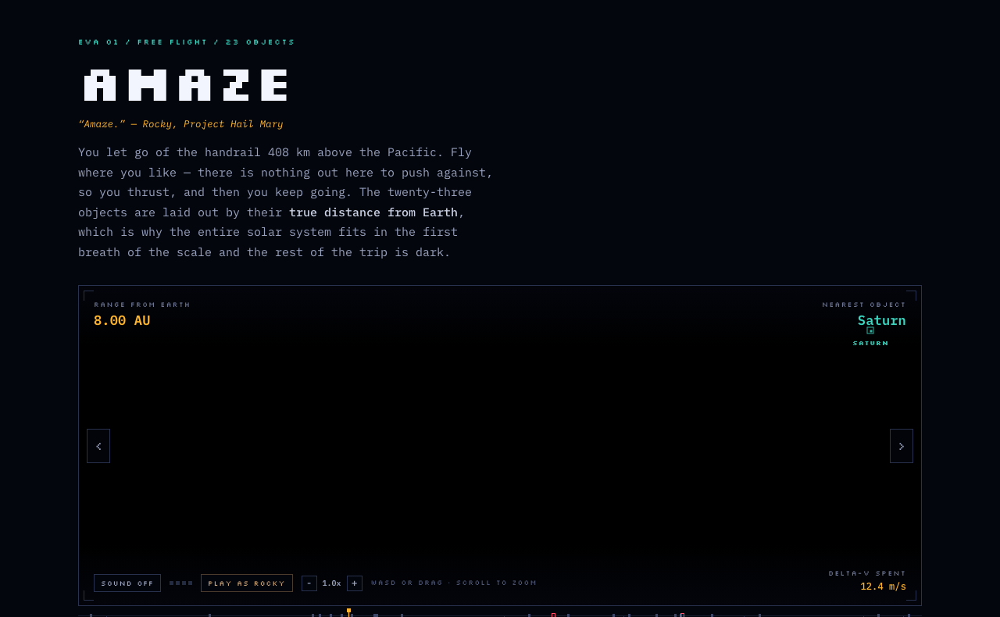
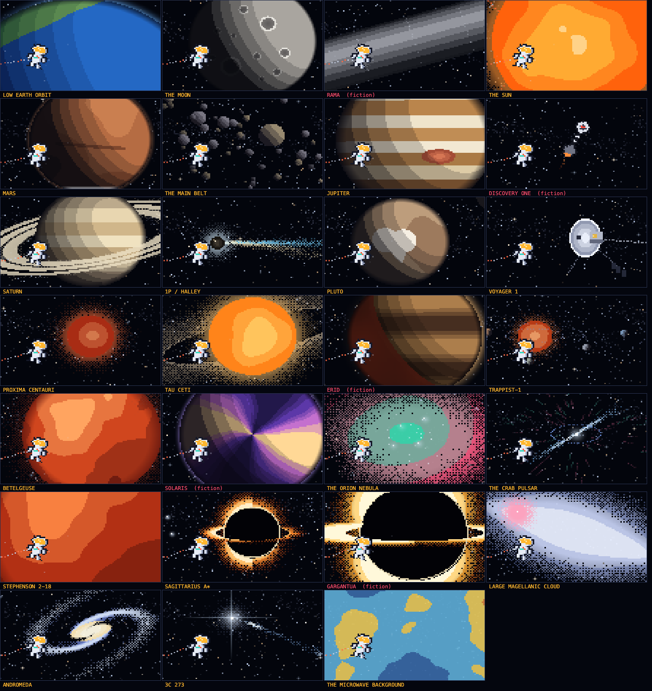
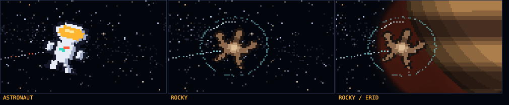

<h1 align="center">AMAZE</h1>

<p align="center"><em>&ldquo;Amaze.&rdquo; &mdash; Rocky, <strong>Project Hail Mary</strong></em></p>

<p align="center">
A pixel-art spacewalk past <strong>23 astronomical objects</strong>, laid out by their<br>
<strong>true distance from Earth</strong> &mdash; from a handrail 408&nbsp;km up to the oldest light there is.
</p>

<p align="center">
  <a href="https://kelvin-jesus.github.io/amaze/"><strong>&#9654;&nbsp; Open it</strong></a>
  &nbsp;&middot;&nbsp; no install, no build, no dependencies
</p>



---

## The idea

Most space pages put objects in a row and call it a tour. This one puts them on a **logarithmic
distance axis**, which changes what you feel.

The entire solar system &mdash; the Moon, the Sun, Mars, the asteroid belt, Jupiter, Saturn, Halley's
comet, Pluto &mdash; collapses into the first breath of the scale. **Voyager 1**, the furthest object our
species has ever moved, barely clears the 1&nbsp;AU mark after forty-nine years of flight. Everything
past it is somewhere nothing of ours will ever reach, and there is a *lot* of axis left.

The range readout interpolates continuously as you fly, so you can watch the number climb from
kilometres to AU to light-years to gigalight-years.

## Controls

| Action | Input |
| --- | --- |
| Thrust | `W` `A` `S` `D` / arrow keys, or drag inside the frame |
| Zoom | scroll, pinch, `+` / `-`, or the `&minus; 1.0x +` cluster (`0` resets) |
| Autopilot | click any object name |
| Swap crew | `C`, or **PLAY AS ROCKY** |
| Sound | `M`, or **SOUND OFF** |

There is no drag in vacuum, so you thrust and then you keep going. The **delta-v counter** is pure
vanity: a real SAFER jetpack carries about 3&nbsp;m/s in total, enough to get you back to the handrail
and no further. You will spend that before you clear the Sun.

## What's out there



| # | Object | Class | Range from Earth |
| --: | --- | --- | --- |
| 1 | Low Earth Orbit | departure point | 408 km |
| 2 | The Moon | natural satellite | 384,400 km |
| 3 | The Sun | G2V main-sequence star | 1 AU |
| 4 | Mars | terrestrial planet | 1.52 AU |
| 5 | The Main Belt | asteroid belt | 2.2&ndash;3.2 AU |
| 6 | Jupiter | gas giant | 5.2 AU |
| 7 | Saturn | gas giant | 9.58 AU |
| 8 | 1P/Halley | periodic comet | 35.1 AU at aphelion |
| 9 | Pluto | dwarf planet | 39.5 AU |
| 10 | Voyager 1 | furthest human object | ~170 AU |
| 11 | Proxima Centauri | red dwarf / flare star | 4.25 ly |
| 12 | **Erid** | *fiction &mdash; Project Hail Mary* | 40 Eridani A, 16.3 ly |
| 13 | TRAPPIST-1 | ultracool dwarf, 7 planets | 40.7 ly |
| 14 | Betelgeuse | red supergiant | ~550 ly |
| 15 | The Orion Nebula | H II region | 1,344 ly |
| 16 | The Crab Pulsar | neutron star | ~6,500 ly |
| 17 | Stephenson 2-18 | largest known star | ~19,570 ly |
| 18 | Sagittarius A* | supermassive black hole | 26,670 ly |
| 19 | **Gargantua** | *fiction &mdash; Interstellar* | &mdash; |
| 20 | Large Magellanic Cloud | satellite galaxy | 163,000 ly |
| 21 | Andromeda | barred spiral galaxy | 2.5 Mly |
| 22 | 3C 273 | first quasar identified | ~2.4 Gly |
| 23 | The Microwave Background | the oldest light | 13.8 Gly |

Every figure on every plaque is a published value. Where astronomers disagree &mdash; Betelgeuse's
distance, Stephenson 2-18's radius &mdash; the disagreement is printed rather than hidden.

### Two of them are fiction, and they say so

**Gargantua** is the black hole built for *Interstellar* (2014) out of real Kerr-metric ray tracing &mdash;
the effects team published two physics papers about what they drew. **Erid** is Rocky's world from
Andy Weir's *Project Hail Mary*, parked at the real 40 Eridani A.

Both wear a **dashed tick** on the axis, because neither has a distance to put on it.

## Crew



Press `C`. Rocky flies in a xenonite bubble, because twenty-nine atmospheres of ammonia do not
travel well.

And because Eridians hear instead of seeing and speak in five-note chords &mdash; fly close to Erid with
the sound on. It answers.

## The soundtrack is not a file

There is no MP3 in this repo. The whole track is generated live in Web Audio, every time:

- **112 BPM**, a continuous four-oscillator drone on C1/C2 under a 21-second filter LFO
- 5.6-second convolution reverb with a 35&nbsp;ms pre-delay, generated at runtime
- kick down to 37&nbsp;Hz, sidechained against the pads; swung shakers; a reverbed rim
- **Cm9 &rarr; Abmaj9 &rarr; Ebmaj7 &rarr; Bb11**, two bars each, voiced so only the top note moves
- bells with an inharmonic 2.76&times; partial, and one three-second sonar ping every eight bars

**It arranges itself around the journey.** In low Earth orbit it is nearly ambient. As you head out,
the drone's filter opens and its detuning widens, the noise wash rises, reverb and delay get wetter,
and layers come in &mdash; shakers, then bass groove and rim, then bells, then a second bell octave.
By the time you reach the quasar it is fully open.

## How it's built

**One HTML file. No dependencies, no build step, no framework.** Open `index.html` in a browser and
it runs.

- **Software renderer.** Every pixel is written into a `Uint32Array` and blitted with one
  `putImageData`, into a buffer roughly 230&times;110 that CSS scales up with `image-rendering: pixelated`.
  Nothing is an image asset &mdash; every planet, nebula, ring system and black hole is drawn from noise,
  posterised shading and 4&times;4 Bayer dithering at runtime.
- **Zoom is real geometry.** Every object renderer already took a scale parameter, so zooming changes
  the world, not the bitmap. The pixels stay the same size and you simply get more space.
- **A tiled value-noise field** built once at startup replaces every `Math.sin` hash, so a frame costs
  array reads instead of transcendentals.
- **Physics in world units**, camera with velocity lead, tether on a verlet distance-constraint chain.
- Roughly **90&nbsp;KB**, which is smaller than most hero images.

## Run it locally

```bash
git clone https://github.com/Kelvin-Jesus/amaze.git
cd amaze
python3 -m http.server 8000   # then open http://localhost:8000
```

Or just double-click `index.html`. There is nothing to install.

## Credits

- Object list from the [Wikipedia lists of astronomical objects](https://en.wikipedia.org/wiki/Lists_of_astronomical_objects)
- Pixel look and free roam inspired by [hallucinate.site](https://hallucinate.site/) by [stagas](https://github.com/stagas)
- Gargantua from *Interstellar* (2014), Kip Thorne & Double Negative
- Rocky and Erid from *Project Hail Mary* by Andy Weir

## License

[MIT](LICENSE)
